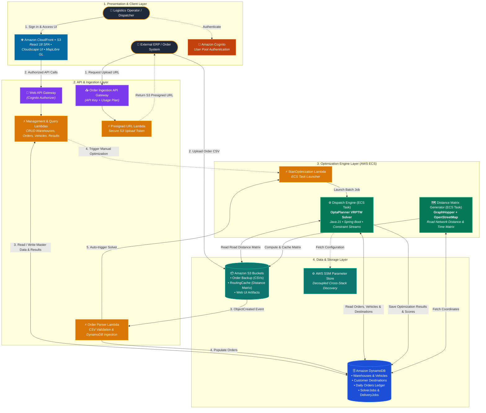

# DispatchO

> **Next-day delivery route optimization and order dispatching platform.**

DispatchO solves the hardest part of last-mile logistics: deciding *which vehicle carries which orders, and in what sequence it drives*, while satisfying real business constraints — vehicle capacity, customer priority, time windows, and owned vs. contracted fleet — all computed over real road networks.

---

## Features

- **Constraint-based optimization** — Multi-objective solver (hard / medium / soft scoring) using [OptaPlanner](https://www.optaplanner.org/)
- **Real road routing** — Actual driving distances and travel times via [GraphHopper](https://www.graphhopper.com/) on OpenStreetMap data
- **Optimization Summary Dashboard** — Fleet-wide metrics: total orders, vehicles used, distance, travel time, capacity utilization, and solver score
- **Per-vehicle Capacity Utilization** — Visual progress bar showing load vs. max capacity for every vehicle
- **Constraint / Risk Warnings** — Fleet-level alerts and per-vehicle badges surfacing real solver-confirmed violations (over-capacity, route > 50 km, too many stops, under-utilized)
- **Interactive map** — Live route visualization with per-segment polylines
- **Serverless cloud backend** — AWS CDK infrastructure: DynamoDB, S3, Cognito, ECS, API Gateway, Lambda

---

## Architecture



### Core Architecture Flows

1. **Operator Path (Web UI & Management)**: Dispatchers access the React SPA hosted on S3 & CloudFront, authenticate through Amazon Cognito, and interact with the fleet management REST API via Amazon API Gateway and AWS Lambda to manage master data (warehouses, vehicles, delivery destinations) and view optimized delivery schedules on interactive maps.
2. **Order Ingestion Path (Automated Pipeline)**: External ERP/WMS systems upload daily order CSVs via Amazon API Gateway presigned URLs directly into S3. An S3 `ObjectCreated` event triggers the Order Parser Lambda, validating records, updating Amazon DynamoDB, and kicking off optimization.
3. **Optimization Engine Path (Batch Compute)**: Triggered automatically or on-demand, an Amazon ECS Fargate task executes the OptaPlanner VRPTW solver engine (Java 21 + Spring Boot), computing multi-objective vehicle routes evaluated against actual OpenStreetMap road network distances cached in S3 by GraphHopper.

---

## Tech Stack

| Layer | Technology |
|---|---|
| Frontend | React 18 + TypeScript + [Cloudscape Design System](https://cloudscape.design/) + MapLibre GL |
| Optimization Engine | Java 21 + Spring Boot + OptaPlanner + GraphHopper |
| Infrastructure | AWS CDK (TypeScript) |
| Build | pnpm workspaces (frontend/infra), Gradle wrapper (engine) |
| Cloud | AWS — DynamoDB, S3, Cognito, ECS, API Gateway, Lambda, SSM |

---

## Optimization Constraints

The solver enforces the following constraints (via OptaPlanner's `HardMediumSoftLongScore`):

**Hard (must be satisfied):**
- Vehicle weight capacity must not be exceeded
- Route distance must not exceed 50 km per trip
- Orders for the same customer must not be split across vehicles when a single vehicle can carry them
- Vehicle time-group assignments must be respected
- Company-owned vehicles are preferred over contracted vehicles

**Medium (optimizer minimizes):**
- Vehicle load should be ≥ 70% of capacity (avoids underutilization)
- Max 5 destination stops per vehicle per trip
- Same customer should be served by a single vehicle

**Soft (distance minimization):**
- Minimize total travel distance across all routes

---

## Project Structure

```
├── apps_web/          # React frontend
├── apps_opt_engine/   # Java optimization engine (OptaPlanner + GraphHopper)
├── apps_infra/        # AWS CDK infrastructure
└── docs/              # Architecture and setup documentation
```

---

## Prerequisites

| Tool | Version |
|---|---|
| Node.js | ≥ 20.19 |
| pnpm | ≥ 10 |
| Java (JDK) | 21 |
| Docker | latest |
| AWS CLI | v2 (configured with credentials) |

---

## Getting Started

### 1. Configure AWS target

Edit [`apps_infra/config/default.yml`](./apps_infra/config/default.yml):
```yaml
env:
  account: "123456789012"   # your AWS account ID
  region: "us-east-1"
administratorEmail: "you@example.com"
```

### 2. Install frontend dependencies
```bash
cd apps_web
pnpm install
pnpm dev        # http://localhost:5173
```

### 3. Deploy infrastructure
```bash
cd apps_infra
pnpm install
pnpm cdk bootstrap
pnpm cdk deploy --all
```

### 4. Build & deploy the optimization engine
```bash
cd apps_opt_engine
./gradlew build
# Docker image is built and pushed to ECR as part of CDK deployment
```

---

## License

[MIT](./LICENSE) © 2024 Tejas H
